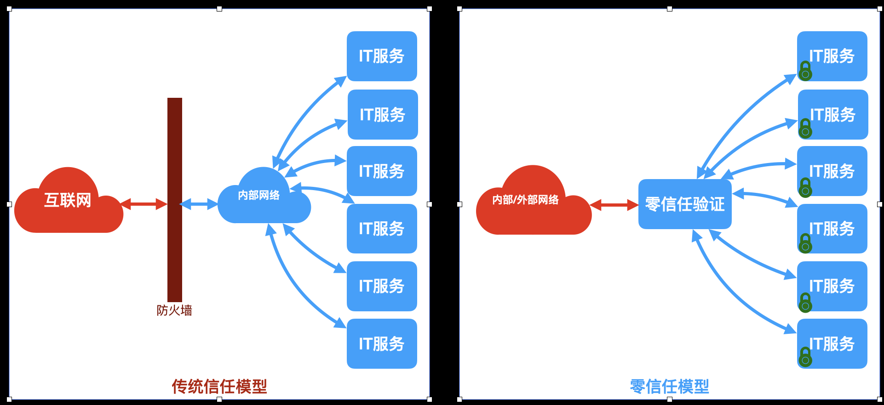

# 零信任(Zero Trust)

零信任是一种安全模型，基于访问主体身份、网络环境、终端状态等尽可能多的信任要素对所有用户进行持续验证和动态授权。**零信任的中心思想就是不信任内部或外部的任何用户、设备、服务或应用程序，必须通过身份和访问管理过程才能获得最低级别的信任和访问权限**

## 为什么零信任很重要？

* 威胁环境的变化：传统的网络安全模型假设内部网络是可信的，但随着网络攻击和数据泄漏的不断增加，内部网络也面临着内部/外部威胁，零信任模型不信任任何用户、设备或网络，可以更好应对不断变化的威胁环境
* 移动办公和云计算的普及：随着移动设备的普及和云计算的广泛应用，网络边界变得模糊，传统的网络安全模型已经无法提供足够的保护。零信任模型基于多重身份验证和访问控制，可以在任何位置和设备上实现安全访问
* 数据泄漏和因素保护：零信任模型通过将网络和数据的访问权限精细化，可以减少敏感信息泄漏的风险。他要求对每个用户和应用程序进行身份验证，并根据需要提供最小访问权限，从而保护数据的安全和隐私
* 快速响应和减少损失：零信任模型强调实时验证和授权，可以更快地检测和响应潜在的威胁。通过及时限制访问权限，可以降低潜在攻击的影响并减少损失。零信任模型还能将资产的暴露面最小化，从而将潜在攻击最小化

## 零信任网络访问（ZTNA）三要素
零信任网络访问（Zero Trust Network Access，ZTNA）一种网络安全架构和技术，旨在强化网络访问的安全性，是零信任的核心实现途径。其核心思想是将网络边界转移到应用层，而不仅仅依赖传统的网络边界来控制访问，这种网络边界是动态的，即每次访问都需要进行验证和授权，而不是一次性的验证。

零信任网络访问由以下三个核心要素构成：
* 软件定义边界(Software Define Perimeter, SDP)：旨在隐藏IT资产，避免将敏感IT资产直接暴露到Internet上，确保只有受信任的用户/设备才能访问IT资产，实现南北向(用户/客户端设备访问IT资产)的网络访问安全。
* 身份与访问管理(Idendity and Access Management, IAM)：旨在建立统一的对IT资产访问的权限体系，确保只有授权的用户/设备才能访问IT资产，并且支持多因素认证(MFA)。
* 微隔离(Micro Segmentation, MS)：确保IT资产(主要是位于数据中心的IT资产)在通信之前，必须先通过身份认证，对特定的IT资产，确保只有授权的IT资产才能访问；实现东西向(IT资产之间)的网络访问安全。

# 铠盾零信任访问服务
## 简介
铠盾零信任访问服务（KAIDUN ZERO TRUST ACCESS SERVICE，简称ZTAS）是一款由杭州蚁象科技有限公司开发并维护，采用最新网络技术的零信任网络安全管理平台。该平台包含三个目标：
1. 帮企业构建安全、高性能、可靠的全球网络，各个数据中心之间以及终端设备/数据中心之间能以安全方式彼此访问，并提供细颗粒化的访问控制授权，实现软件定义网络
2. 帮企业隐藏暴露到互联网上的IT服务，使得未经授权的用户/设备无法扫描到企业在互联网上部署的IT服务，从而在极大程度上避免IT服务受到攻击
3. 提供多重信任因素的身份与访问管理(IAM)，帮助企业完善IT资产访问的权限体系，确保只有授权的用户/设备才能访问IT资产, 最小化IT资产暴露面以及遭遇攻击时的影响范围

ZTAS基于定义的访问控制策略，缺省情况下拒绝访问，并在明确授权时向用户提供服务访问权。 与VPN不同，ZTAS解决方案对IT服务的访问默认为拒绝，仅提供用户已明确授权的服务访问权限，作为一种安全策略，ZTAS在缺省情况下，所有用户和设备都被视为不信任，直到他们可以通过身份验证并明确得到授权。

## ZTAS关键概念
* 域(Domain)：每个企业在平台里都有一个唯一的域，域之间的网络是完全隔离的。每个域有一个域管理员（Admin）, 负责管理当前域的所有零信任访问功能的配置
* 域用户(Domain User)：域管理员可以为当前域注册用户，将用户的令牌分享给对应的用户，用户凭该令牌在ZTAS-MARS程序登录，生成Mars设备，域管理员可以为每个Mars设备设置IT服务的访问权限
* 数据中心(Datacenter)：数据中心是同一局域网内能互相访问的IT设备的集合，一个域，可以包含任意多个数据中心，可以来自公有云，私有云
* Venus设备：运行在Linux设备上的ZTAS-VENUS程序，会采集宿主设备的特征，生成独一无二的设备指纹，生成Venus设备，每台Venus设备由该设备指纹标识
* VENUS程序：运行在Linux宿主机上的核心程序，依据对应Venus设备的零信任安全规则，通过内核模块对宿主设备上的TCP会话进行零信任保护
* 零信任安全规则：对Venus设备上的TCP会话进行零信任保护的指令，包含方向(Ingress/Egress)，源IP地址/端口，目标IP地址/端口，指纹，以及保护策略（Accept/Reject/ZTP）
* 东西向访问保护(East/West Protection, EWP)：用于保护VENUS设备之间访问IT服务的安全
* Mars设备：指域用户在特定的终端设备（Windows/Linux/Darwin）上通过ZTAS-MARS程序登录后，由程序采集终端设备的特征信息，结合用户的ID，生成独一无二的指纹，从而生成Mars设备，不同的用户在同一台设备上有不同的指纹。Mars设备是一种多重信任因素认证机制，确保用户只能在特定的设备上依据零信任策略访问IT服务

## ZTAS构成

ZTAS平台由以下系统构成：
* ZTAS-SUN：平台的核心管理服务器，用于存储企业的数据中心、用户、设备、IT服务，零信任策略，DNS解析等，以公有云方式提供，也支持私有化部署
* ZTAS-MERCURY：平台的管理端，管理企业的数据中心、用户、设备、IT服务、零信任策略、DNS解析等
* ZTAS-VENUS：运行于Linux服务器上的程序，依据来自ZTAS-SUN的零信任策略，通过内核模块对宿主机上的TCP会话进行零信任保护
* ZTAS-EARTH：运行于Linux上，部署在数据中心里的服务程序，是零信任安全网关，为ZTAS-MARS设备提供安全隧道，确保授权的ZTAS-MARS设备能访问经过授权的IT服务
* ZTAS-MARS：这运行于Windows/Linux/Darwin终端，跟ZTAS-EARTH建立安全隧道，使得用户能通过该程序依据安全策略实现对数据中心内IT服务的访问，并提供本地化的DNS解析服务

# ZTAS-SUN
这是平台的核心，用于管理组织机构的数据中心、IT服务、设备、用户访问权限、零信任策略、DNS等。该系统由本平台提供，用户无需单独部署。

同时，平台也提供了私有化部署版本，具体请参见[ZTAS-SUN私有化部署](sun/README.md)。

# ZTAS-MERCURY
这是管理端，组织机构的管理员通过该程序注册组织机构的域，管理域内的用户，数据中心、数据中心内的Venus设备，IT服务，EWP管理,NSP管理、DNS管理等。

支持的操作系统：
* Linux：支持
* Windows: 支持
* Mac: 支持

## 下载和安装

### Linux
到[Linux](mercury/linux) 目录里下载ZIP包，存放于本地，解压即可。

### Windows
到[Windows](mercury/windows) 目录里下载ZIP包，存放于本地，解压即可。

### Mac
到[Mac](mercury/darwin) 目录里下载ZIP包，存放于本地，解压即可。

## 用户手册
[ZTAS-Mercury用户手册](mercury/README.md)

# ZTAS-VENUS
ZTAS-VENUS（简称VENUS）是运行在Linux设备上的程序，用于对运行在Linux设备上的IT服务会话或者经过Linux设备的IT服务会话进行零信任保护。

具体使用方式，请参见[ZTAS-VENUS使用手册](venus/README.md)

# ZTAS-MARS
ZTAS-MARS(简称MARS)是运行在Linux、Windows、Mac终端上的程序，让域用户通过该程序和数据中心之间的安全隧道，访问数据中心内的授权过的IT服务。

具体使用方式，请参见[ZTAS-MARS使用手册](mars/README.md)

# ZTAS-EARTH
ZTAS-EARTH(以下简称EARTH)是运行在Linux服务器上的程序，用于跟MARS终端建立安全隧道，并通过安全隧道，依据安全规则访问数据中心内的IT服务。

具体使用方式，请参见[ZTAS-EARTH使用手册](earth/README.md)

# 联系开发者
如果有任何企业/组织对本解决方案感兴趣，请通过QQ联系开发者：1107018439@qq.com
