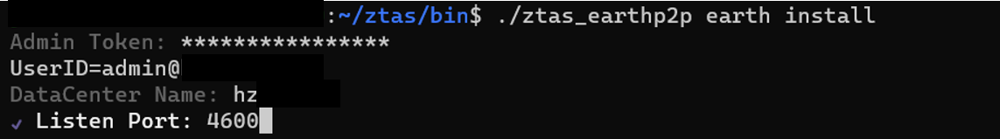

#ZTAS-EARTH
ZTAS-EARTH(以下简称EARTH)是运行在Linux服务器上的程序，用于跟MARS终端建立安全隧道，并通过安全隧道，依据安全规则访问数据中心内的IT服务。

支持的操作系统：
* Linux(AMD64): 支持

# 下载和安装
先下载[EARTH安装包](linux/earth.zip)到本地，并解压即可。

## 设置和安装
下载后，需要先完成如下设置：
1. 打开命令行窗口，转到ztas_earthp2p程序所在目录，输入如下命令：
```
$./ztas_earthp2p earth install
```
程序会显示如下的安装界面：



其中：
* Boot URI: 如果企业/组织部署了私有化的ZTAS-SUN服务，则需要在此输入ZTAS-SUN服务的P2P URL，否则此处填空
* Admin Token：是域管理员的令牌
* Datacenter Name: EARTH所在的数据中心名称
* Listen Port: EARTH服务的监听端口，该监听端口是UDP协议

安装完成后，会在系统里创建一个ztas_earthp2p的系统服务。

## 性能优化建议
本平台的所有程序都通过基于QUIC协议的P2P网络进行相互通信，如果EARTH程序和MARS终端之间无法建立直接连接，则需要进行P2P打洞，目前P2P打洞的成功率不高，通常需要通过P2P网络的中继节点建立安全隧道，这样将会大大降低安全隧道的通信速度，从而影响用户体验。平台建议在数据中心的路由器上添加一条UDP的NAT记录，将EARTH程序的局域网IP地址和监听端口(UDP协议)映射到数据中心的公网IP和端口上，这样EARTH和Mars终端之间能直接连接，从而提升安全隧道的通信速度，提升用户体验。

# EARTH的启动和停止
管理员可以通过系统提供的systemctl启动和停止EARTH服务。
```
#systemctl start ztas_earthp2p
#systemctl stop ztas_earthp2p
```
