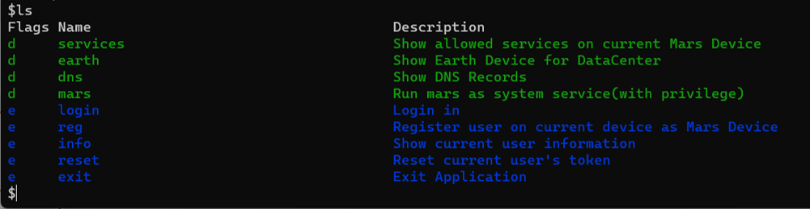
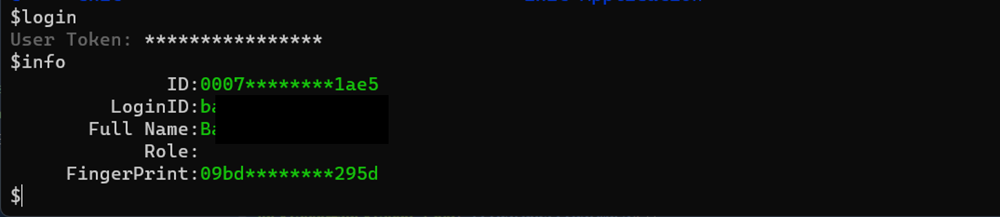
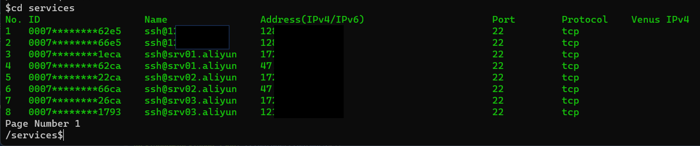
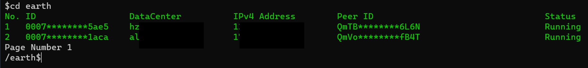
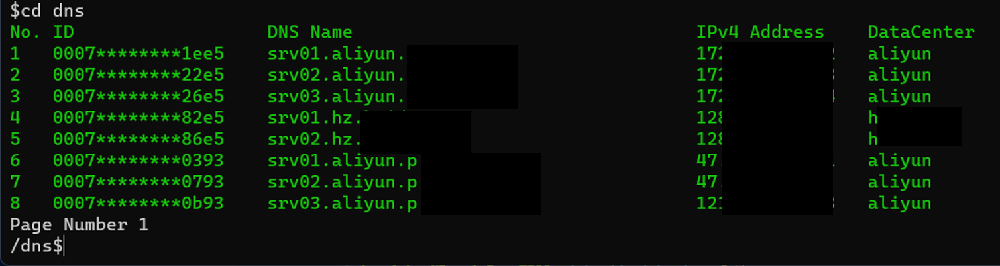
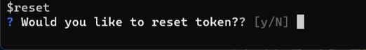
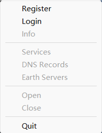

# ZTAS-MARS

ZTAS-MARS(简称MARS)是运行在Linux、Windows、Mac终端上的程序，让域用户通过该程序和数据中心之间的安全隧道，访问数据中心内的授权过的IT服务，同时提供本地的DNS解析服务，允许通过域名访问授权的IT服务。

以下是ZTAS-MARS对各个操作系统的支持情况：

|===操作系统===|===架构===|===支持状态===|
|-------------|----------|-------------|
|Windows| amd64 | <font color="green">支持</font>|
|Windows| arm64 | <font color="red">正在开发</font>|
|Linux| amd64|  <font color="green">支持</font>|
|Linux| arm64| <font color="red">正在开发</font>|
|Darwin| amd64| <font color="red">正在开发</font>|
|Darwin| arm64|<font color="green">支持</font>|

# 下载和安装

## 下载
### Windows操作系统
1. 请下载[Windows](windows/mars.zip)程序包，并解压到本地的目录。
2. 从[Winpcap](https://winpcap.org)下载并安装WinPcap依赖包。

### Linux操作系统
1. 请下载[Linux](linux/mars.zip)程序包，并解压到本地的目录。
2. 安装libpcap依赖包。安装方式因Linux发行版不同而有所差异。

### MacOS
1. 请下载[MacOS](darwin/ZTASMars.zip)程序包，并解压到本地的目录。
2. 安装libpcap依赖包。

## 命令行管理
在Windows, Darwin, Linux终端上，都支持通过命令行来管理Mars设备。

### 私有化部署设置

如果ZTAS-SUN做了私有化部署，则需要对marscli进行设置。打开命令行窗口，转到程序所在目录，执行如下命令进行设置：

```
#假定~/ztas/bin是程序所在目录
cd ~/ztas/bin 
./marscli setup
```

程序会提示你输入如下参数：

* Boot URI:如果企业/组织部署了私有化的ZTAS-SUN服务，则需要在此输入ZTAS-SUN服务的P2P URL，否则此处填空
* User Token: 用户的令牌，管理员在MERCURY中创建的用户的令牌，由16个字符构成

### 系统服务注册
marscli需要注册一个名为ztas_marsp2p的系统服务。系统服务注册过程如下：

Linux和Darwin系统：
1. 打开命令行窗口，并转到marscli所在的目录
2. 输入sudo ./marscli service install

Windows系统：
1. 以管理员权限打开命令行窗口
2. 执行.\marscli.exe service install

在Windows和Darwin系统上，ZTASMars的GUI程序会自动完成系统服务注册。

### 系统服务的启动和停止

系统服务注册后，需要将ztas_marsp2p这个系统服务启动起来，MARS程序才能正常工作。

#### 启动
Linux和Darwin系统：
1. 打开命令行窗口，并转到marscli所在的目录
2. 输入sudo ./marscli service start

Windows系统：
1. 以管理员权限打开命令行窗口
2. 执行.\marscli.exe service start

#### 停止
Linux和Darwin系统：
1. 打开命令行窗口，并转到marscli所在的目录
2. 输入sudo ./marscli service stop

Windows系统：
1. 以管理员权限打开命令行窗口
2. 执行.\marscli.exe service stop

Windows/Darwin系统还可以通过GUI程序ZTASMars的Start/Stop菜单来启动/停止系统服务。

### 命令行管理界面
打开系统的命令行窗口，转到marscli所在目录，执行如下命令，进入mars的命令行管理界面：

Linux和Darwin系统：
```
./marscli
```

Windows系统：
```
.\marscli.exe
```
程序会出现一个命令行管理界面，如下图所示：


#### MARS设备注册
在命令行窗口管理界面，输入reg命令，然后输入用户的令牌(该令牌由域管理员在ZTAS-MERCURY创建用户后得到),即可完成MARS设备注册。

#### 用户登录
在命令行窗口管理界面，输入login命令，然后输入用户的令牌，即可完成用户登录。

#### 查看MARS设备信息
登录后，可以在命令行窗口输入info命令，即可查看当前MARS设备的信息，如下图所示：



#### 查看MARS设备可访问IT服务列表
登录后，可以在命令行窗口输入cd services命令，即可查看当前MARS设备可访问的IT服务列表，如下图所示：



#### 查看Earth设备运行列表
Earth设备部署在数据中心，用于跟Mars设备建立安全隧道，并允许Mars设备访问经过授权的数据中心内的IT服务，而无需将IT服务暴露到互联网上。

登录后，可以在命令行窗口输入cd earth命令，即可查看当前Earth设备的运行状态，如下图所示：



上图列出了每个Earth设备所属的数据中心、IP地址、以及运行状态。MARS终端和EARTH设备通过P2P网络连接，保证了连接的安全性和稳定性。

#### 查看DNS列表
登录后，可以在命令行窗口输入cd dns命令，即可查看当前当前域的域名解析记录，如下图所示：



#### 重设令牌
用户可以重设通过重设令牌，让旧令牌失效。

登录后，在命令行窗口输入reset，程序会提示如下：



用户输入y后，会重设令牌，并打印新令牌，用户需要将该令牌保存在安全的地方。


# 图形化管理界面ZTASMars
在Windows和MacOS上提供了图形化管理程序。


|===操作系统===|===架构===|===图形化程序名称===|
|-------------|----------|-------------|
|Windows|amd64|ZTASMars.exe|
|MacOS(Darwin)|arm64|ZTASMars.app|

## 程序主界面
当启动MarsApp后，会在系统的状态栏里出现一个图标，图标的菜单如下：



其中：
* Reg: 用于注册Mars设备
* Login: 登录用户
* Info: 显示当前用户的信息(登录后)
* Services: 显示当前Mars设备能访问的IT服务列表
* Earth Servers: 显示当前域内各个数据中心的Earth服务器运行状态
* DNS Records: 显示当前域的私有DNS记录
* Open: 建立当前Mars设备跟数据中心的安全隧道，使得客户端能访问数据中心内被授权的IT服务
* Close: 关闭当前Mars设备跟数据中心的安全隧道
* Start: 启动ztas-marsp2p系统服务
* Stop: 停止ztas- marspp系统服务
* Quit: 退出当前程序
