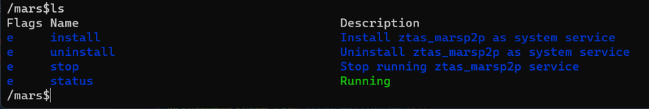

# ZTAS-MARS

ZTAS-MARS(简称MARS)是运行在Linux、Windows、Mac终端上的程序，让域用户通过该程序和数据中心之间的安全隧道，访问数据中心内的授权过的IT服务，同时提供本地的DNS解析服务，允许通过域名访问授权的IT服务。

以下是ZTAS-MARS对各个操作系统的支持情况：

|===操作系统===|===架构===|===支持状态===|
|-------------|----------|-------------|
|Windows| amd64 | <font color="green">支持</font>|
|Windows| arm64 | <font color="red">正在开发</font>|
|Linux| amd64|  <font color="green">支持</font>|
|Linux| arm64| <font color="red">正在开发</font>|
|Darwin| amd64| <font color="red">正在开发</font>|
|Darwin| arm64|<font color="red">正在开发</font>|

# 下载和安装

## 下载
### Windows操作系统
1. 请下载[Windows](windows/mars.zip)程序包，并解压到本地的目录。
2. 从[Winpcap](https://winpcap.org)下载并安装WinPcap依赖包。

### Linux操作系统
1. 请下载[Linux](linux/mars.zip)程序包，并解压到本地的目录。
2. 安装libpcap依赖包。安装方式因Linux发行版不同而有所差异。

## 安装
1. 以超级管理员权限启动marscli程序。具体方式因操作系统不同而有所差异，在此不详述，程序会进入一个命令行管理界面。
2. 在命令行管理界面输入login命令，然后输入用户的令牌，完成用户登录，该令牌在MERCURY的用户管理中心可以查看到。
3. 在命令行管理界面输入reg命令，完成当前用户在当前设备上的注册，生成Mars设备。
4. 在命令行管理界面输入cd mars命令，进入mars系统服务管理界面。
5. 输入install命令，完成ztas_marsp2p系统服务的安装。

# 启动和停止MARS系统服务
MARS程序下载和安装完成后，会创建一个ztas_marsp2p的系统服务。

## Windows
在Windows终端上，可以通过以下途径启动/停止MARS系统服务。

### 通过任务管理器


以Windows/10/11为例，打开任务管理器，点击“服务”，然后找到ztas_marsp2p服务，再通过鼠标右键即可完成服务的启动/停止。

### 通过命令行
1. 以管理员身份打开一个命令窗口，并转到marscli.exe所在目录。
2. 在命令行窗口里，输入marscli.exe命令，进入MARS的命令行界面。
3. 在MARS的命令行窗口，输入cd mars命令。
4. 通过ls查看ztas-marsp2p的运行状态，以及可用的命令。
5. 通过输入start命令启动ztas_marsp2p系统服务，或者
6. 通过输入stop命令停止ztas_marsp2p系统服务。



## Linux
在Linux终端上，可以通过以下途径启动/停止Mars系统服务。

### 通过系统命令
可以通过系统提供的systemctl程序启动/停止ztas_marsp2p系统服务。

```
#systemctl start ztas_marsp2p
#systemctl stop ztas_marsp2p
```

### 通过MARS命令行程序
通过MARS命令行程序启动/停止ztas_marsp2p系统服务。

1. 以管理员身份打开一个命令窗口，并转到marscli所在目录。
2. 在命令行窗口里，输入./marscli命令，进入MARS的命令行界面。
3. 在MARS的命令行窗口，输入cd mars命令。
4. 通过ls查看ztas-marsp2p的运行状态，以及可用的命令。
5. 通过输入start命令启动ztas_marsp2p系统服务，或者
6. 通过输入stop命令停止ztas_marsp2p系统服务


# 命令行功能

## 启动

### Windows
1. 以管理员身份打开一个命令窗口，并转到marscli.exe所在目录。
2. 在命令行窗口里，输入marscli.exe命令，进入MARS的命令行界面。

### Linux
1. 以管理员身份打开一个命令窗口，并转到marscli所在目录。
2. 在命令行窗口里，输入./marscli命令，进入MARS的命令行界面。


## 注册MARS设备
用户在新设备上运行MARS程序，要先注册MARS设备，在MARS的命令行窗口，输入reg命令，程序会提示要求输入用户的令牌，当用户输入合法的令牌后，即可完成设备的注册。

## 登录
在命令行窗口首页，输入login命令，即可显示用户登录界面，如下图所示：


其中：
* User Token：是域用户管理员在MERCURY程序中添加用户后，生成的用户令牌。

## 查看MARS设备信息
登录后，可以在命令行窗口输入info命令，即可查看当前MARS设备的信息，如下图所示：


## 查看MARS设备可访问IT服务列表
登录后，可以在命令行窗口输入cd services命令，即可查看当前MARS设备可访问的IT服务列表，如下图所示：


## 查看Earth设备运行列表
Earth设备部署在数据中心，用于跟Mars设备建立安全隧道，并允许Mars设备访问经过授权的数据中心内的IT服务，而无需将IT服务暴露到互联网上。

登录后，可以在命令行窗口输入cd earth命令，即可查看当前Earth设备的运行状态，如下图所示：


上图列出了每个Earth设备所属的数据中心、IP地址、以及运行状态。MARS终端和EARTH设备通过P2P网络连接，保证了连接的安全性和稳定性。

## 查看DNS列表
登录后，可以在命令行窗口输入cd dns命令，即可查看当前当前域的域名解析记录，如下图所示：


## 重设令牌
用户可以重设通过重设令牌，让旧令牌失效。

登录后，在命令行窗口输入reset，程序会提示如下：


用户输入y后，会重设令牌，并打印新令牌，用户需要将该令牌保存在安全的地方。
