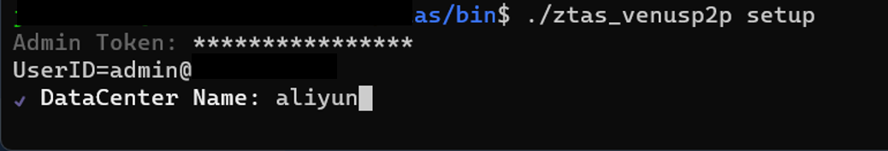

# ZTAS-VENUS

ZTAS-VENUS（简称VENUS）是运行在Linux设备上的程序，用于对运行在Linux设备上的IT服务会话或者经过Linux设备的IT服务会话进行零信任保护。

支持的操作系统：
* Linux

# 下载和安装

## 下载

从[Linux](./linux/ztas_venusp2p)下载程序，存到本地。

## 安装和设置
VENUS程序会以系统服务方式运行。在运行之前，需要先完成以下设置：
1. 设置，打开命令行窗口，转到VENUS程序所在目录，执行以下命令：
```
$./ztas_venusp2p setup
```
系统会显示如下的界面：



在设置界面依次输入Admin Token和Datacenter Name，其中：
* Boot URI:如果企业/组织部署了私有化的ZTAS-SUN服务，则需要在此输入ZTAS-SUN服务的P2P URL，否则此处填空
* Admin Token:是域管理员的令牌
* Datacenter Name: 是数据中心的名称，需要先在MERCURY程序中创建好

2. 安装系统服务，打开命令行窗口，转到VENUS程序所在目录，以超级管理员权限执行以下命令：
```
#./ztas_venusp2p service install
```
当上述安装命令执行成功后，一个名为ztas_venusp2p的系统服务将创建成功。

## 启动和停止

1. 启动ztas_venusp2p服务
打开命令行窗口，以超级管理员权限执行以下命令：
```
systemct start ztas_venusp2p
```

2. 停止ztas_venusp2p服务
打开命令行窗口，以超级管理员权限执行以下命令：
```
systemct stop ztas_venusp2p
```

## 防火墙设置

数据中心里的服务器，往往都会设置比较严格的网络访问措施，可能导致Venus设备无法跟平台的SUN服务器通讯，从而导致设置和服务启动失败。

为了让VENUS程序能正常工作，需要在防火墙上打开以下协议的IP地址和端口：


| ===协议=== | ===IP地址=== | ===端口=== | ===说明=== |
| --------- | --------- | --------- | ---------|
| UDP | 47.96.140.23 | 7200 | 平台所用的P2P网络的种子节点|
| UDP | 47.110.41.171 | 7200 | 平台所用的P2P网络的种子节点|
| UDP | 47.96.140.23 | 7501 | 平台P2P网络的SUN节点的服务端口|
